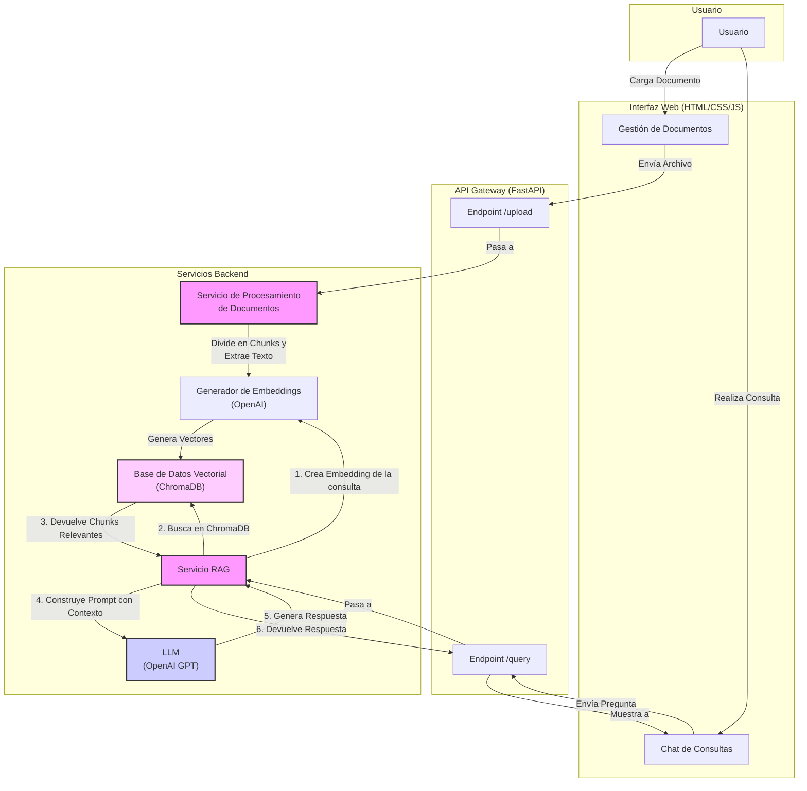

# 🚀 RAG FinanzAuto

## Descripción

RAG FinanzAuto es un sistema de **Retrieval-Augmented Generation (RAG)** diseñado como asistente de conocimiento para desarrolladores. El sistema procesa documentación técnica, la indexa en una base de datos vectorial, y proporciona respuestas precisas a consultas utilizando modelos de lenguaje grandes (LLMs).

## 🏗️ Arquitectura del Sistema

El sistema está compuesto por:

- **Servicio de Procesamiento de Documentos**: Ingesta y procesa documentos (PDF, TXT, MD, DOCX)
- **Servicio de Embeddings**: Genera embeddings usando OpenAI o Sentence-Transformers
- **Base de Datos Vectorial**: ChromaDB para almacenamiento y búsqueda de vectores
- **Servicio de Consultas RAG**: Búsqueda semántica con ranking de relevancia
- **Integración LLM**: OpenAI (GPT-3.5, GPT-4, GPT-4o)
- **Interfaz Web**: Frontend estático (HTML/CSS/JS) para chat y gestión de documentos
- **API REST**: Endpoints completos para todas las funcionalidades

### Diagrama de Flujo de Datos



## 🚀 Inicio Rápido

Aquí tienes un resumen de los comandos para ejecutar la aplicación en diferentes entornos.

| Entorno                                 | Comando de Inicio                                                     | Comando de Parada        | Notas                                                               |
| --------------------------------------- | --------------------------------------------------------------------- | ------------------------ | ------------------------------------------------------------------- |
| **Local (Python + Conda)**              | `conda activate rag_finanzauto && ./start.sh`                         | `Ctrl+C`                 | Recomendado para desarrollo y pruebas rápidas.                       |
| **Docker (Estándar)**                   | `docker-compose up --build -d`                                        | `docker-compose down`    | Ideal para un entorno de producción autocontenido.                |
| **Docker (con Monitoreo)**              | `docker-compose --profile monitoring up --build -d`                   | `docker-compose down`    | Añade Prometheus y Grafana para observabilidad.                     |
| **Kubernetes**                          | `kubectl apply -f k8s/ -n rag-finanzauto`                             | `kubectl delete -f k8s/` | Para despliegues escalables y gestionados en un clúster.          |

*Para más detalles sobre cada opción, consulta la sección de [Instalación y Configuración](#-instalación-y-configuración) o [Despliegue](#-despliegue-con-docker).*

## 🛠️ Stack Tecnológico

### Backend
- **Python 3.11**: Lenguaje principal
- **FastAPI**: Framework web asíncrono
- **ChromaDB**: Base de datos vectorial
- **LangChain**: Procesamiento de documentos
- **Sentence-Transformers**: Embeddings locales
- **OpenAI**: API de LLM

### Frontend
- **HTML5**
- **CSS3**
- **JavaScript (Vanilla)**

### Infraestructura
- **Docker**: Containerización
- **Docker Compose**: Orquestación local
- **Nginx**: Reverse proxy (opcional)
- **Prometheus + Grafana**: Monitoreo (opcional)

### Procesamiento de Documentos
- **PyPDF2**: Procesamiento de PDFs
- **python-docx**: Procesamiento de documentos Word
- **Markdown**: Procesamiento de archivos Markdown

## 🚀 Instalación y Configuración

### Prerrequisitos

- **Miniconda** o **Anaconda** (recomendado)
- **Docker** y **Docker Compose** (opcional)
- **Git**

### Opción 1: Instalación con Miniconda (Recomendada para Desarrollo)

1. **Clonar el repositorio**:
```bash
git clone https://github.com/your-username/rag-finanzauto.git
cd rag-finanzauto
```

2. **Crear y activar el entorno conda**:
```bash
# Crear entorno desde environment.yml (optimizado para CPU)
conda env create -f environment.yml

# Activar el entorno
conda activate rag_finanzauto
```

3. **Configurar variables de entorno**:
```bash
# Copiar archivo de ejemplo
cp env.example .env

# Editar .env con tus API keys
nano .env
```

4. **Configurar las API Keys en .env**:
```env
# LLM API Keys (OpenAI es requerida)
OPENAI_API_KEY=tu_clave_openai_aqui

# Configuración de la aplicación
DEBUG=true
LOG_LEVEL=INFO
CHUNK_SIZE=1000
CHUNK_OVERLAP=200
TOP_K_RESULTS=5
SIMILARITY_THRESHOLD=0.7
```

5. **Ejecutar la aplicación**:
```bash
# El método recomendado es usar el script de inicio automatizado:
./start.sh

# Esto iniciará todos los servicios y abrirá la interfaz web automáticamente.
# Para detener todo, presiona Ctrl+C en la terminal donde se ejecuta el script.
```

### Limpieza de Base de Datos

La base de datos vectorial (ChromaDB) persiste entre sesiones. Para limpiar datos residuales:

```bash
# Limpiar solo la base de datos vectorial
python cleanup_database.py --db-only

# Limpiar todo (base de datos, uploads, logs)
python cleanup_database.py --all

# Limpiar forzadamente sin confirmación
python cleanup_database.py --force --all

# Ver opciones disponibles
python cleanup_database.py --help
```

### Opción 2: Instalación con Docker

1. **Clonar el repositorio**:
```bash
git clone https://github.com/your-username/rag-finanzauto.git
cd rag-finanzauto
```

2. **Configurar variables de entorno**:
```bash
cp env.example .env
# Editar .env con tus API keys
```

3. **Ejecutar con Docker Compose**:
```bash
# Solo la aplicación principal
docker-compose up -d rag-app

# Con servicios adicionales (nginx, monitoring)
docker-compose --profile production --profile monitoring up -d
```

## 📖 Documentación de la API

### Endpoints Principales

#### 🔍 Consultas RAG
- **POST** `/api/v1/query/` - Procesar consulta RAG
- **GET** `/api/v1/query/history` - Historial de consultas
- **GET** `/api/v1/query/similar` - Consultas similares
- **GET** `/api/v1/query/stats` - Estadísticas del servicio

#### 📄 Gestión de Documentos
- **POST** `/api/v1/documents/upload` - Subir documento
- **GET** `/api/v1/documents/status/{document_id}` - Estado del procesamiento
- **GET** `/api/v1/documents/{document_id}/chunks` - Chunks del documento
- **DELETE** `/api/v1/documents/{document_id}` - Eliminar documento
- **GET** `/api/v1/documents/` - Listar documentos

#### ❤️ Salud del Sistema
- **GET** `/api/v1/health/` - Health check básico
- **GET** `/api/v1/health/detailed` - Health check detallado

### Ejemplos de Uso

#### 1. Subir un Documento
```bash
curl -X POST "http://localhost:8000/api/v1/documents/upload" \
  -H "Content-Type: multipart/form-data" \
  -F "file=@documento.pdf"
```

#### 2. Realizar una Consulta RAG
```bash
curl -X POST "http://localhost:8000/api/v1/query/" \
  -H "Content-Type: application/json" \
  -d '{
    "query": "¿Cómo funciona la autenticación en el sistema?",
    "top_k": 5,
    "similarity_threshold": 0.7
  }'
```

#### 3. Verificar Estado del Sistema
```bash
curl -X GET "http://localhost:8000/api/v1/health/detailed"
```

## 🌐 Interfaz Web

Accede a la interfaz web en **http://localhost:8081**.

El script de inicio `./start.sh` la abrirá por ti automáticamente. La interfaz se conecta a la API que se ejecuta en `http://localhost:8000`.

La interfaz incluye:
- **📄 Gestión de Documentos**: Upload para PDF, TXT, MD, DOCX.
- **🔍 Consultas RAG**: Chat interactivo.

## 🔧 Configuración Avanzada

### Variables de Entorno

```env
# Configuración de la aplicación
APP_HOST=0.0.0.0
APP_PORT=8000
DEBUG=true
LOG_LEVEL=INFO

# Procesamiento de documentos
MAX_FILE_SIZE_MB=50
CHUNK_SIZE=1000
CHUNK_OVERLAP=200

# Configuración RAG
TOP_K_RESULTS=5
SIMILARITY_THRESHOLD=0.7
MAX_TOKENS=2000
TEMPERATURE=0.1

# Base de datos vectorial
CHROMA_PERSIST_DIRECTORY=./data/chroma_db

# APIs de LLM
OPENAI_API_KEY=tu_clave_aqui

# Pinecone (opcional)
PINECONE_API_KEY=tu_clave_aqui
PINECONE_ENVIRONMENT=tu_entorno_aqui
```

### Modelos Soportados

#### Embeddings
- **OpenAI**: text-embedding-3-small, text-embedding-3-large (único proveedor)

#### LLMs
- **OpenAI**: gpt-3.5-turbo, gpt-4, gpt-4-turbo, gpt-4o

## 🐳 Despliegue con Docker

### Desarrollo Local
```bash
# El método recomendado es usar el script de inicio:
./start.sh

# Si prefieres hacerlo manualmente, puedes usar Docker Compose:
docker compose up --build

# Para ejecutar en segundo plano:
docker compose up --build -d
```

### Producción
```bash
# Con nginx y monitoreo
docker-compose --profile production --profile monitoring up -d

# Verificar estado
docker-compose ps
docker-compose logs rag-app
```

## ☸️ Despliegue en Kubernetes

El despliegue en Kubernetes utiliza una arquitectura de "reverse proxy" donde el Ingress dirige todo el tráfico al Frontend (Nginx), y este a su vez sirve los archivos estáticos y redirige las llamadas de API al Backend.

### Prerrequisitos
- Un clúster de Kubernetes funcional (ej. Minikube, Kind, GKE, EKS, AKS).
- `kubectl` instalado y configurado para apuntar a tu clúster.
- Un Ingress Controller (como NGINX Ingress Controller) instalado. Si usas Minikube, actívalo con: `minikube addons enable ingress`.
- Un registro de contenedores (como Docker Hub) al que tengas acceso.

### Paso 1: Construir y Subir las Imágenes de Docker

Kubernetes necesita descargar las imágenes de tu aplicación desde un registro. Reemplaza `tu-usuario-dockerhub` con tu nombre de usuario.

1.  **Iniciar sesión en Docker Hub:**
    ```bash
    docker login
    ```

2.  **Construir y etiquetar (tag) las imágenes:**
    ```bash
    # Construir la imagen del backend
    docker build -t tu-usuario-dockerhub/rag-finanzauto-backend:latest -f Dockerfile .

    # Construir la imagen del frontend (el contexto es la carpeta 'frontend/')
    docker build -t tu-usuario-dockerhub/rag-finanzauto-frontend:latest -f frontend/Dockerfile frontend/
    ```

3.  **Subir las imágenes al registro:**
    ```bash
    docker push tu-usuario-dockerhub/rag-finanzauto-backend:latest
    docker push tu-usuario-dockerhub/rag-finanzauto-frontend:latest
    ```
    *Nota: Es una buena práctica usar etiquetas de versión (ej. `:v1`, `:v2`) en lugar de `:latest` para asegurar que Kubernetes siempre descargue la versión correcta de la imagen.*

### Paso 2: Actualizar los Manifiestos con tu Imagen

Antes de desplegar, abre `k8s/backend.yaml` y `k8s/frontend.yaml` y asegúrate de que el campo `image:` en cada archivo apunte a las imágenes que acabas de subir (ej. `image: tu-usuario-dockerhub/rag-finanzauto-backend:latest`).

### Paso 3: Desplegar la Aplicación en Kubernetes

1.  **Crear el Namespace (si no existe):**
    ```bash
    kubectl create namespace rag-finanzauto
    ```

2.  **Crear el Secreto para la API Key:** Carga el secreto directamente desde tu archivo `.env`.
    ```bash
    kubectl create secret generic rag-secrets --from-env-file=.env -n rag-finanzauto
    ```

3.  **Aplicar todos los manifiestos:** Este comando despliega todos los componentes (Backend, Frontend, ConfigMap de Nginx e Ingress) de una sola vez.
    ```bash
    kubectl apply -f k8s/ -n rag-finanzauto
    ```

### Paso 4: Acceder a la Aplicación (Ejemplo con Minikube)

1.  **Obtén la IP de tu clúster:**
    ```bash
    minikube ip
    ```
    Copia la dirección IP que te devuelve.

2.  **Configura tu archivo `/etc/hosts`:** Necesitas decirle a tu sistema dónde encontrar `rag.finanzauto.com`.
    ```bash
    # Abre el archivo con permisos de administrador
    sudo nano /etc/hosts

    # Añade la siguiente línea al final del archivo, reemplazando la IP por la de Minikube
    192.168.49.2    rag.finanzauto.com
    ```

3.  **¡Accede a la aplicación!** Abre tu navegador y ve a:
    **http://rag.finanzauto.com**

## 📊 Monitoreo y Observabilidad

### Métricas Disponibles
- Tiempo de respuesta de consultas
- Número de documentos procesados
- Uso de memoria y CPU
- Estado de servicios externos

### Prometheus + Grafana
```bash
# Activar monitoreo
docker-compose --profile monitoring up -d

# Acceder a Grafana
open http://localhost:3000
# Usuario: admin, Contraseña: admin
```

### Logs
```bash
# Ver logs en tiempo real
docker-compose logs -f rag-app

# Logs específicos
docker-compose logs --tail=100 rag-app
```

## 🧪 Estrategias de Evaluación Avanzada

### 1. Evaluación de Relevancia con Bootstraping
```python
# Métricas implementadas con intervalos de confianza (95%)
- Hit Rate@K (K=1,3,5,10)
- Precision@K
- Recall@K
- NDCG (Normalized Discounted Cumulative Gain)
- MRR (Mean Reciprocal Rank)
- Bootstrap Confidence Intervals
```

### 2. Evaluación de Calidad de Respuestas
```python
# Métricas de evaluación avanzadas
- ROUGE-1, ROUGE-2, ROUGE-L
- BLEU Score
- Semantic Coherence (embeddings)
- Length Ratio
- Keyword Precision/Recall/F1
- Bootstrap Confidence Intervals
```

### 3. Evaluación de Rendimiento del Sistema
```python
# Métricas de rendimiento
- Tiempo de respuesta promedio
- Throughput (consultas por segundo)
- Uso de recursos (CPU, memoria)
- Latencia de embeddings
- Número de chunks recuperados
- Tasa de éxito de consultas
```

### 4. Scripts de Evaluación Disponibles

#### Evaluación Básica
```bash
# Evaluación estándar
python evaluation/evaluate.py
```

#### Evaluación Avanzada con Bootstraping
```bash
# Evaluación con intervalos de confianza
python evaluation/evaluate_advanced.py
```

#### Visualización de Resultados
```bash
# Visualización básica
python evaluation/visualize_metrics.py

# Visualización avanzada con intervalos de confianza
python evaluation/visualize_advanced_metrics.py
```

#### Ejecución Automatizada Completa
```bash
# Ejecutar todas las evaluaciones y generar reportes
python evaluation/run_all_evaluations.py
```

#### Ejemplo de Uso
```bash
# Ver ejemplo de cómo usar las funcionalidades
python evaluation/example_usage.py
```

### 5. Métricas Calculadas por Dataset

#### FIQA Dataset
- **Hit Rate@5**: Tasa de acierto en los primeros 5 resultados
- **ROUGE-L**: Coincidencia de secuencias más largas
- **Semantic Coherence**: Coherencia semántica entre pregunta y respuesta
- **Processing Time**: Tiempo promedio de procesamiento

#### SQuAD-ES Dataset
- **Hit Rate@5**: Tasa de acierto en los primeros 5 resultados
- **ROUGE-L**: Coincidencia de secuencias más largas
- **BLEU Score**: Evaluación de calidad de traducción
- **Keyword F1**: Precisión de palabras clave

### 6. Configuración de Evaluación
```python
# Configuración actual
TEMPERATURE=0.0  # Respuestas determinísticas
TOP_K_RESULTS=10  # Más resultados para mejor recall
SIMILARITY_THRESHOLD=0.5  # Umbral más permisivo
BOOTSTRAP_SAMPLES=1000  # Muestras para intervalos de confianza
CONFIDENCE_LEVEL=0.95  # Nivel de confianza del 95%
```

## 🔧 Desarrollo y Contribución

### Configuración del Entorno de Desarrollo

1. **Instalar dependencias de desarrollo**:
```bash
# Es recomendable usar el script de configuración inicial la primera vez:
./scripts/setup.sh

# Luego, activa el entorno:
conda activate rag_finanzauto

# Si necesitas instalar más dependencias manualmente:
pip install -r requirements.txt
pip install pytest black flake8 mypy
```

2. **Configurar pre-commit hooks**:
```bash
pre-commit install
```

3. **Ejecutar tests**:
```bash
# Tests unitarios
pytest tests/unit/

# Tests de integración
pytest tests/integration/

# Todos los tests
pytest
```

4. **Formatear código**:
```bash
# Formatear con black
black app/

# Linting con flake8
flake8 app/

# Type checking con mypy
mypy app/
```

### Estructura del Proyecto
```
rag_finanzauto/
├── app/
│   ├── api/            # Endpoints FastAPI
│   ├── core/           # Configuración y logging
│   ├── models/         # Esquemas Pydantic
│   ├── services/       # Lógica de negocio
│   └── utils/          # Utilidades
├── tests/
│   ├── unit/           # Tests unitarios
│   └── integration/    # Tests de integración
├── docs/               # Documentación
├── k8s/                # Manifiestos Kubernetes
├── monitoring/         # Configuración de monitoreo
├── docker-compose.yml  # Orquestación local
├── Dockerfile          # Imagen de contenedor
└── requirements.txt    # Dependencias Python
```

## 📝 Decisiones Arquitectónicas

### 1. Base de Datos Vectorial
**Decisión**: ChromaDB
**Razón**: 
- Fácil de configurar y usar
- Soporte nativo para embeddings
- Persistencia local
- Escalabilidad horizontal

### 2. Framework Web
**Decisión**: FastAPI
**Razón**:
- Alto rendimiento asíncrono
- Documentación automática
- Validación de tipos
- Ecosistema Python robusto

### 3. Procesamiento de Documentos
**Decisión**: LangChain + bibliotecas especializadas
**Razón**:
- Abstracciones útiles para RAG
- Soporte para múltiples formatos
- Estrategias de chunking avanzadas
- Integración con LLMs

### 4. Embeddings
**Decisión**: Solo OpenAI embeddings
**Razón**:
- Máxima calidad y consistencia
- Menor complejidad de dependencias
- No requiere PyTorch ni modelos pesados
- Instalación más rápida y ligera

### 5. LLMs
**Decisión**: OpenAI como proveedor principal
**Razón**:
- Modelos de alta calidad y confiabilidad
- API estable y bien documentada
- Soporte para múltiples modelos (GPT-3.5, GPT-4, GPT-4o)
- Simplificación de dependencias

## 🚨 Troubleshooting

### Problemas Comunes

#### 1. Error de API Key
```bash
# Verificar que las API keys estén configuradas
cat .env | grep API_KEY

# Verificar que el servicio detecte las keys
curl http://localhost:8000/api/v1/health/detailed
```

#### 2. Problemas de Memoria
```bash
# Aumentar límites de memoria en Docker
docker-compose up --build -d
docker stats rag-finanzauto-app

# Reducir chunk_size en .env
CHUNK_SIZE=500
```

#### 3. Problemas de Embeddings
```bash
# Verificar que el modelo se descargue correctamente
docker-compose logs rag-app | grep "sentence-transformers"

# Limpiar caché de embeddings
curl -X DELETE http://localhost:8000/api/v1/embeddings/cache
```

#### 4. Problemas de ChromaDB
```bash
# Reiniciar base de datos vectorial
curl -X POST http://localhost:8000/api/v1/documents/reset

# Verificar permisos de directorio
ls -la data/chroma_db/
```

## 📞 Soporte y Contacto

- **Issues**: [GitHub Issues](https://github.com/your-username/rag-finanzauto/issues)
- **Documentación**: [Wiki del proyecto](https://github.com/your-username/rag-finanzauto/wiki)
- **Email**: soporte@finanzauto.com

## 📄 Licencia

Este proyecto está licenciado bajo la Licencia MIT - ver el archivo [LICENSE](LICENSE) para más detalles.

## 🙏 Agradecimientos

- **LangChain**: Framework para aplicaciones LLM
- **ChromaDB**: Base de datos vectorial
- **FastAPI**: Framework web moderno
- **Sentence-Transformers**: Embeddings de alta calidad
- **OpenAI**: API de LLM

---

**Desarrollado para FinanzAuto** 